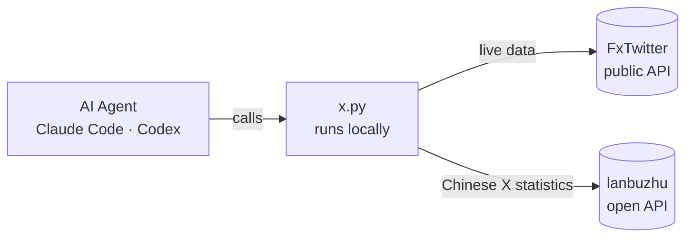

<div align="center">

# X-Aggregate-Data

**Let your AI agent read X (Twitter)**

Tweets · Threads · Search · Profiles · Timelines · Followers · Translation · Daily stats of Chinese-speaking X

No X API · No login · No subscription · No keys

[](LICENSE)
[](https://www.python.org/)
[](#requirements)
[](https://agentskills.io)
[](https://claude.com/claude-code)
[](https://openai.com/codex)

[中文](README.md) · **English**

</div>

---

## Overview

AI agents such as Claude Code and Codex can't open x.com: their web tools are either blocked or get an empty page. To have an agent research an account, a tweet or a topic, you usually have two options: pay for the official API, or let another LLM "summarize" X for it. The first is expensive; the second gives you a second-hand summary with numbers you can't verify.

**X-Aggregate-Data** is an [Agent Skill](https://agentskills.io). Once installed, whenever your agent meets an X link, account or topic, it calls a local script and gets back **structured raw data** in 1–3 seconds: text, timestamps, views, likes, reposts, quotes, replies, bookmarks, media, Community Notes and more. Every number is a raw value the agent can sort, sum and compare.

Beyond live data, it also connects to the **Chinese-speaking X statistics** tracked by [lanbuzhu.org](https://lanbuzhu.org): daily views, posts, replies and follower growth for thousands of Chinese accounts, leaderboards, daily champions, daily reports, and an activity feed of deleted tweets (with the original text), renames and follower spikes.

## Features

- **Zero setup**: just Python 3.8+ (preinstalled on macOS). No X account, API key, paid plan or third-party packages.
- **Raw data**: structured JSON, not an LLM's paraphrase. Numbers are returned as-is.
- **Broad coverage**: single tweets, threads, replies, quotes, full text of X Articles, profiles (including X's "based in" country and username-change count), timelines, advanced search, following / followers, translation.
- **Chinese X statistics**: per-account daily data and 30-day trends, multi-dimension leaderboards, daily champions, daily reports, activity feed, hot tweets, trending topics, rumor reports.
- **Built for agents**: compact, consistent output; incomplete results are flagged with `more`; errors are JSON too, with stable exit codes so the agent knows what to do next.
- **Safe**: read-only. Never logs in, posts, or touches your accounts. Invisible control characters are stripped, and the skill tells the agent to treat tweet content as data, not instructions.
- **Cross-platform**: macOS / Linux / Windows. Uses the system proxy or `HTTPS_PROXY` automatically.

## Quick start

### Requirements

| Item | Requirement |
| --- | --- |
| Python | 3.8+, standard library only (macOS ships `/usr/bin/python3`; on Windows use `py -3` or `python`) |
| Agent | Any agent that supports [Agent Skills](https://agentskills.io), e.g. Claude Code, Codex. Other agents or scripts can call the CLI directly |
| Network | Access to `api.fxtwitter.com` (live data) and `lanbuzhu.org` (statistics) |

### Install

**Option 1: [skills CLI](https://github.com/vercel-labs/skills) (recommended)**

```bash
npx skills add qianyubtc/X-Aggregate-Data -g
```

Pick the agents to install to when prompted, or specify one: `npx skills add qianyubtc/X-Aggregate-Data -g -a claude-code`.

**Option 2: copy manually**

```bash
git clone https://github.com/qianyubtc/X-Aggregate-Data.git
cp -r X-Aggregate-Data/skills/x-aggregate-data ~/.claude/skills/   # Claude Code
cp -r X-Aggregate-Data/skills/x-aggregate-data ~/.codex/skills/    # Codex
```

### Verify

```bash
python3 ~/.claude/skills/x-aggregate-data/scripts/x.py user jack --pretty
```

If you see jack's profile, the network and the script are working.

### Codex

Codex's sandbox blocks network access by default. Approve running outside the sandbox the first time, or add this to `~/.codex/config.toml`:

```toml
[sandbox_workspace_write]
network_access = true
```

## Usage

### Just ask your agent

No commands to memorize. Ask in plain language and the agent picks the right command:

```text
What does this tweet say, and how are people reacting in the replies? https://x.com/.../status/...
What did @elonmusk post this week? Sort by likes.
Which Chinese tweets about SOL got the most likes in the last 24 hours?
Which country is this account based in, and how many times has it changed its username?
Translate this X Article into English and summarize the key points.
Top 10 Chinese X accounts by follower growth yesterday.
Which big accounts deleted tweets recently, and what did they delete?
```

### Command line

The script also works on its own and prints JSON, so you can plug it into your own tools:

```bash
X=skills/x-aggregate-data/scripts/x.py

python3 $X tweet https://x.com/jack/status/20 --replies 20 --pretty      # tweet + replies
python3 $X tweets elonmusk --since 7d --limit 50                         # last 7 days
python3 $X search '$BTC lang:zh' --since 24h --min-likes 50 --sort likes # most liked in 24h
python3 $X user @dotey                                                   # profile
python3 $X rank --by gain --when yday --limit 10                         # yesterday's top gainers
python3 $X -h                                                            # all commands
```

## Command reference

### Live data (any account, any tweet)

| Command | Description | Common options |
| --- | --- | --- |
| `tweet <url or id>` | Read a tweet; full text for Articles | `--thread` author's thread · `--replies N` · `--quotes N` · `--translate en` · `--about` full author profile |
| `user <handle>` | Profile: followers, following, tweet count, join date, bio, based-in country, username changes | |
| `tweets <handle>` | Timeline; the author's own posts and quotes by default | `--limit` · `--since 7d` · `--replies` · `--reposts` · `--media` |
| `search "<query>"` | Search with X's advanced operators | `--limit` · `--since` / `--until` · `--min-likes N` · `--sort likes\|views\|…` · `--top` |
| `following <handle>` / `followers <handle>` | Following / followers | `--limit` · `--full` |
| `translate <url or id>` | Translate a tweet | `--to en` |

Handles can be `@handle`, `handle` or a profile URL; tweets can be a URL (x.com, twitter.com, t.co) or an id. See [references/search.md](skills/x-aggregate-data/references/search.md) for search operators.

### Chinese X statistics (from lanbuzhu.org)

| Command | Description |
| --- | --- |
| `stats <handle>` | Views, posts, replies and follower growth for today / yesterday / 7 / 30 days, 30-day daily trend and rank, championships, recent activity |
| `rank` | Leaderboards: `--by views\|posts\|replies\|gain\|fans\|avgv\|maxv` · `--when today\|yday\|7d\|30d` · `--track ai\|crypto\|finance\|media` |
| `champions` | Daily champions and top 5 for posts / replies / growth / views |
| `daily [YYYY-MM-DD]` | Daily report, latest by default |
| `feed` | Activity: deleted tweets (with text), renames, bio / avatar changes, follower spikes, interactions, viral tweets; `--type` · `--handle` |
| `hot` | Hot tweets: `--hours 3\|6\|12\|24` · `--sort heat\|views` |
| `topics` | Trending topics |
| `rumors` / `rumor <url>` | Rumor list / report for one tweet (for reference only) |

A "day" runs from 08:00 to 08:00 Beijing time (a UTC day); "posts" are original tweets plus quotes. See [references/lanbuzhu.md](skills/x-aggregate-data/references/lanbuzhu.md) for definitions and fields.

## Output

Every command prints one JSON object. Times are UTC (ISO 8601) and empty fields are omitted. For example, `tweet https://x.com/jack/status/20`:

```json
{
  "tweet": {
    "id": "20",
    "url": "https://x.com/jack/status/20",
    "created_at": "2006-03-21T20:50:14Z",
    "author": {
      "handle": "jack",
      "name": "jack",
      "id": "12",
      "followers": 12488056,
      "following": 3,
      "verified": true
    },
    "text": "just setting up my twttr",
    "lang": "en",
    "likes": 312077,
    "reposts": 124602,
    "quotes": 7283,
    "replies": 18074,
    "bookmarks": 21938
  }
}
```

Conventions:

- **Numbers are raw values** at the moment of the request, never formatted.
- **Lists include `more`**: `true` means there is more data that wasn't fetched.
- **Errors are JSON too**: `{"error": "…", "hint": "…"}`, with exit codes:

| Exit code | Meaning | What to do |
| --- | --- | --- |
| `0` | Success | |
| `1` | Network unreachable | Check the proxy, or whether the agent's sandbox allows network access |
| `2` | Bad input or arguments | Read `hint` and retry |
| `4` | Not found / not accessible | Deleted tweet, missing or protected account; for statistics, the account isn't tracked |
| `5` | Rate limited or temporary upstream error | Wait a minute or two and retry |

## How it works



1. The agent reads `SKILL.md` and knows which command to run for an X-related question.
2. The script runs **on your own machine** and talks to the data sources directly. There is no relay server in between.
3. It returns compact, structured JSON to the agent, which uses it to answer you.

## Data sources and limits

| Data | Source | Limits |
| --- | --- | --- |
| Live data | The public API of [FxTwitter](https://github.com/FxEmbed/FxEmbed) (the open-source project behind fxtwitter.com) | Rate limited; the script slows down between pages. The API may change in the future |
| Chinese X statistics | [lanbuzhu.org](https://lanbuzhu.org) open API (`/api/open/v1`, read-only, free) | Per IP: 60 requests/minute, 3,000/day, up to 300 distinct accounts/day. Tracked accounts only |

Not possible or not complete:

- Protected accounts, DMs and likes lists are not accessible.
- Replies are mostly but not fully available: hidden, deleted and protected replies are missing.
- Accounts down-ranked in X search may "disappear" from search results; use `tweets` to see what someone posted.
- Following / followers are returned in X's order, not necessarily by follow date.

Please use it responsibly: don't bulk-scrape thousands of accounts or poll at high frequency.

## Privacy and security

**What leaves your machine**

- Live-data requests go from your IP to FxTwitter, which can see which tweets, accounts and search terms you look up.
- Statistics commands send the requested handle from your IP to lanbuzhu.org.
- Expanding a t.co link makes one request to t.co. Nothing else is contacted, and nothing is collected.

**Prompt-injection defense**

Tweets, names, bios and articles are written by anyone and may hide instructions aimed at hijacking your agent. Two layers of defense:

1. Invisible characters (Unicode tag characters, bidi controls, zero-width characters) are stripped before output; they are commonly used to hide instructions that humans can't see but models can read.
2. `SKILL.md` explicitly tells the agent to treat all text from X as data, never as instructions.

The script only sends GET requests to read data. It never logs in, posts or changes anything.

## FAQ

<details>
<summary><b>Do I need an X account? Can this get me banned?</b></summary>

No account is needed. The script never logs in or uses any of your accounts, so there is nothing to ban.
</details>

<details>
<summary><b>Does it work behind a proxy?</b></summary>

Yes. The system proxy is used automatically, or set `HTTPS_PROXY=http://127.0.0.1:<port>`. Only HTTP proxies are supported, not SOCKS.
</details>

<details>
<summary><b>Windows says <code>python3</code> is not found</b></summary>

Windows usually has no `python3` command. Use `py -3 x.py …` or `python x.py …`. Console encoding for non-ASCII text is handled by the script.
</details>

<details>
<summary><b>Why doesn't the reply count match X?</b></summary>

X's reply count includes hidden, deleted and protected replies, which aren't accessible. `replies_info` tells you how many were fetched and whether there are more.
</details>

<details>
<summary><b>Which accounts do the statistics cover?</b></summary>

Thousands of active Chinese-speaking X accounts tracked by lanbuzhu.org, growing automatically. For an untracked account you get a 404 with a link where you can recommend it; tracked accounts join the leaderboards after a 2-day observation period.
</details>

<details>
<summary><b>Why is "today" incomplete?</b></summary>

A day runs from 08:00 to 08:00 Beijing time, and follower growth and replies are complete only after the day ends. Use `--when yday` for reliable numbers; `pending` in the response means the numbers are still being collected.
</details>

<details>
<summary><b>I'm being rate limited</b></summary>

On exit code `5`, wait a minute or two and retry. Slow down batch jobs or lower `--limit`.
</details>

## Project layout

```text
X-Aggregate-Data/
├── skills/x-aggregate-data/
│   ├── SKILL.md              # what the agent reads: when and how to use it, rules
│   ├── scripts/x.py          # the CLI (single file, Python stdlib)
│   ├── references/
│   │   ├── search.md         # X search operators
│   │   └── lanbuzhu.md       # definitions and fields of the statistics
│   └── agents/openai.yaml    # display info for Codex
├── README.md
├── README.en.md
├── CHANGELOG.md
└── LICENSE
```

## Contributing

[Issues](https://github.com/qianyubtc/X-Aggregate-Data/issues) and pull requests are welcome. Before submitting code:

- Use the Python standard library only and stay compatible with Python 3.8.
- Keep the output compact: an agent's context is precious, so don't add fields nobody uses.
- When adding a command or option, update `SKILL.md` and both READMEs.

## License and disclaimer

Released under the [MIT License](LICENSE).

This is an unofficial tool and is not affiliated with X Corp. Use it in compliance with local laws and X's Terms of Service. When using lanbuzhu statistics, please credit "lanbuzhu.org".

Live data is powered by the public API of [FxEmbed](https://github.com/FxEmbed/FxEmbed). Thank you.
