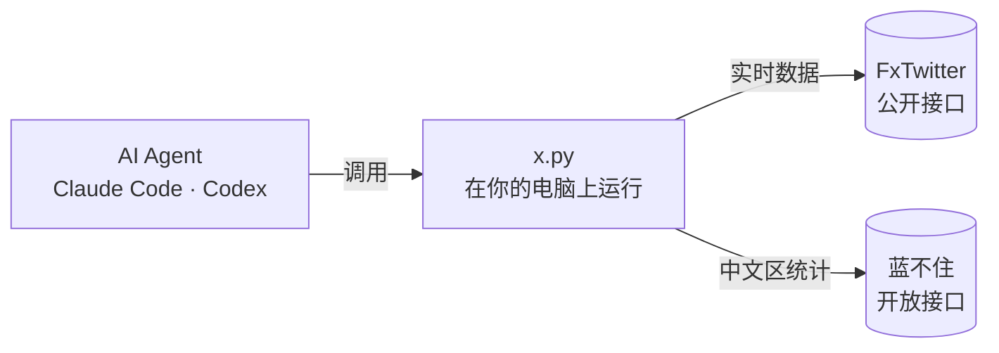

<div align="center">

# X-Aggregate-Data

**让你的 AI Agent 读得到 X（Twitter）**

推文 · 对话 · 搜索 · 账号 · 时间线 · 关注列表 · 翻译 · X 中文区每日数据

不用 X API · 不用登录 · 不用会员 · 不用 Key

[](LICENSE)
[](https://www.python.org/)
[](#环境要求)
[](https://agentskills.io)
[](https://claude.com/claude-code)
[](https://openai.com/codex)

**中文** · [English](README.en.md)

</div>

---

## 简介

Claude Code、Codex 这类 AI Agent 打不开 x.com：网页工具不是被拦，就是只拿到一个空页面。想让 Agent 帮你研究某个账号、某条推、某个话题，通常只有两条路：付费买官方 API，或者让另一个大模型"转述"给它——前者贵，后者拿到的是一段二手总结，数字没法核对。

**X-Aggregate-Data** 是一个 [Agent Skill](https://agentskills.io)：装上之后，Agent 遇到 X 的链接、账号或话题，会自己调用一个本地脚本，在 1–3 秒内拿回**结构化的原始数据**——正文、发布时间、浏览、点赞、转发、引用、回复、收藏、图片视频、社区笔记……每个数字都是原始值，可以直接计算和比较。

除了实时数据，它还接入了 [蓝不住 lanbuzhu.org](https://lanbuzhu.org) 长期跟踪的 **X 中文区统计**：数千个中文账号每天的曝光、发帖、评论、涨粉，排行榜、每日冠军、日报，以及大V删帖（带原文）、改名、粉丝异动等动态。

## 特性

- **零门槛**：只需要 Python 3.8+（macOS 自带），不需要 X 账号、API Key 或任何付费订阅，不安装任何第三方依赖。
- **原始数据**：返回结构化 JSON，不经过大模型转述；数字原样给出，Agent 可以直接排序、求和、对比。
- **覆盖面广**：单条推文、整串 thread、回复区、引用、X 长文（Article）全文、账号资料（含 X 判定的所在地、改名次数）、时间线、高级搜索、关注 / 粉丝列表、翻译。
- **中文区统计**：账号逐日数据和 30 天走势、多维度排行、每日冠军、日报、大V动态、热帖、话题、谣言库。
- **为 Agent 设计**：输出紧凑、字段一致；结果不完整时明确标出 `more`；出错时也返回 JSON 和固定的退出码，Agent 知道下一步该做什么。
- **安全**：只读，不登录、不发帖、不碰你的任何账号；自动去掉文本里看不见的控制字符，并在说明里要求 Agent 把推文内容当作数据而不是指令。
- **跨平台**：macOS / Linux / Windows；自动使用系统代理或 `HTTPS_PROXY`，国内网络开着代理即可使用。

## 快速开始

### 环境要求

| 项目 | 要求 |
| --- | --- |
| Python | 3.8 或以上，只用标准库（macOS 自带 `/usr/bin/python3`；Windows 安装 Python 后用 `py -3` 或 `python`） |
| Agent | 支持 [Agent Skills](https://agentskills.io) 的 Agent，如 Claude Code、Codex；其他 Agent 或脚本也可以直接调用命令行 |
| 网络 | 能访问 `api.fxtwitter.com`（实时数据）和 `lanbuzhu.org`（中文区统计）；国内网络需开代理 |

### 安装

**方式一：使用 [skills CLI](https://github.com/vercel-labs/skills)（推荐）**

```bash
npx skills add qianyubtc/X-Aggregate-Data -g
```

按提示选择要安装到的 Agent。也可以直接指定：`npx skills add qianyubtc/X-Aggregate-Data -g -a claude-code`。

**方式二：手动复制**

```bash
git clone https://github.com/qianyubtc/X-Aggregate-Data.git
cp -r X-Aggregate-Data/skills/x-aggregate-data ~/.claude/skills/   # Claude Code
cp -r X-Aggregate-Data/skills/x-aggregate-data ~/.codex/skills/    # Codex
```

### 验证安装

```bash
python3 ~/.claude/skills/x-aggregate-data/scripts/x.py user jack --pretty
```

能看到 jack 的账号资料，就说明网络和脚本都正常。

### Codex 用户

Codex 的沙箱默认禁止联网，第一次运行时同意它在沙箱外执行即可；如果不想每次确认，在 `~/.codex/config.toml` 中加入：

```toml
[sandbox_workspace_write]
network_access = true
```

## 使用

### 在 Agent 里直接提问

安装后不需要记任何命令，用自然语言提问即可，Agent 会自己选择合适的命令：

```text
这条推说了什么？回复区大家怎么看？ https://x.com/.../status/...
@elonmusk 这周发了什么？按点赞排个序
最近 24 小时中文区关于 SOL 点赞最多的讨论有哪些？
这个号是哪个国家的、改过几次名？
帮我把这篇 X 长文翻译成中文并总结要点
昨天 X 中文区涨粉最多的 10 个号
最近有哪些大V删帖了？删的是什么？
```

### 命令行

脚本也可以单独使用，输出是 JSON，方便接入你自己的程序：

```bash
X=skills/x-aggregate-data/scripts/x.py

python3 $X tweet https://x.com/jack/status/20 --replies 20 --pretty      # 推文 + 回复区
python3 $X tweets elonmusk --since 7d --limit 50                         # 最近 7 天的推
python3 $X search '$BTC lang:zh' --since 24h --min-likes 50 --sort likes # 24 小时内点赞最多
python3 $X user @dotey                                                   # 账号资料
python3 $X rank --by gain --when yday --limit 10                         # 昨日涨粉榜
python3 $X -h                                                            # 全部命令
```

## 命令参考

### 实时数据（任意账号、任意推文）

| 命令 | 说明 | 常用参数 |
| --- | --- | --- |
| `tweet <链接或 id>` | 读一条推；长文给全文 | `--thread` 作者接的整串 · `--replies N` 回复区 · `--quotes N` 引用 · `--translate zh` 翻译 · `--about` 作者完整资料 |
| `user <账号>` | 账号资料：粉丝、关注、发帖数、注册时间、简介、所在地、改名次数 | |
| `tweets <账号>` | 时间线，默认只要本人的原创和引用 | `--limit` · `--since 7d` · `--replies` · `--reposts` · `--media` |
| `search "<查询>"` | 搜索，支持 X 高级搜索语法 | `--limit` · `--since` / `--until` · `--min-likes N` · `--sort likes\|views\|…` · `--top` |
| `following <账号>` / `followers <账号>` | 关注 / 粉丝列表 | `--limit` · `--full` |
| `translate <链接或 id>` | 翻译一条推 | `--to zh` |

账号可以写 `@账号`、`账号` 或主页链接；推文可以写链接（x.com、twitter.com、t.co 短链均可）或 id。搜索语法速查见 [references/search.md](skills/x-aggregate-data/references/search.md)。

### X 中文区统计（数据来自 lanbuzhu.org）

| 命令 | 说明 |
| --- | --- |
| `stats <账号>` | 账号今天 / 昨日 / 7 天 / 30 天的曝光、发帖、评论、涨粉，近 30 天逐日走势和名次，夺冠记录，最近动态 |
| `rank` | 账号排行：`--by views\|posts\|replies\|gain\|fans\|avgv\|maxv` · `--when today\|yday\|7d\|30d` · `--track ai\|crypto\|finance\|media` |
| `champions` | 发帖 / 评论 / 涨粉 / 曝光四项冠军和前 5 |
| `daily [YYYY-MM-DD]` | 日报，默认最新一期 |
| `feed` | 大V动态：删帖（带原文）、改名改简介换头像、粉丝异动、互相转发引用、爆款；`--type` · `--handle` |
| `hot` | 中文区热帖：`--hours 3\|6\|12\|24` · `--sort heat\|views` |
| `topics` | 正在火的话题 |
| `rumors` / `rumor <链接>` | 谣言库 / 某条推的检测报告（仅供参考） |

统计口径（一天 = 北京时间 8 点到次日 8 点、发帖 = 原创 + 引用等）和字段说明见 [references/lanbuzhu.md](skills/x-aggregate-data/references/lanbuzhu.md)。

## 输出格式

所有命令都输出一个 JSON 对象，时间统一为 UTC（ISO 8601），空字段会被省略。例如 `tweet https://x.com/jack/status/20`：

```json
{
  "tweet": {
    "id": "20",
    "url": "https://x.com/jack/status/20",
    "created_at": "2006-03-21T20:50:14Z",
    "author": {
      "handle": "jack",
      "name": "jack",
      "id": "12",
      "followers": 12488056,
      "following": 3,
      "verified": true
    },
    "text": "just setting up my twttr",
    "lang": "en",
    "likes": 312077,
    "reposts": 124602,
    "quotes": 7283,
    "replies": 18074,
    "bookmarks": 21938
  }
}
```

几条约定：

- **数字是抓取那一刻的原始值**，不做"1.2 万"这类格式化。
- **列表类结果带 `more`**：为 `true` 表示还有没拿到的，结果不完整。
- **出错时同样输出 JSON**：`{"error": "…", "hint": "…"}`，并用退出码区分原因：

| 退出码 | 含义 | 建议 |
| --- | --- | --- |
| `0` | 成功 | |
| `1` | 网络连不上 | 检查代理；Agent 沙箱是否允许联网 |
| `2` | 输入或参数不对 | 看 `hint`，改正后重试 |
| `4` | 没找到 / 看不了 | 推文已删、账号不存在或受保护；中文区统计为"未收录" |
| `5` | 限流或数据源临时出错 | 等一两分钟再试 |

## 工作原理



1. Agent 读到 `SKILL.md`，知道遇到 X 相关的问题该调用哪个命令。
2. 脚本在**你自己的电脑上**直接请求数据源，中间没有任何代理或转发服务器。
3. 脚本把结果整理成紧凑的结构化 JSON 交回 Agent，Agent 再据此回答你。

## 数据来源与限制

| 数据 | 来源 | 限制 |
| --- | --- | --- |
| 实时数据 | [FxTwitter](https://github.com/FxEmbed/FxEmbed) 的公开接口（fxtwitter.com 背后的开源项目） | 有频率限制，脚本翻页时会自动放慢；接口未来可能变化 |
| 中文区统计 | [蓝不住 lanbuzhu.org](https://lanbuzhu.org) 开放接口（`/api/open/v1`，只读、免费） | 每个 IP 每分钟 60 次、每天 3000 次、最多查 300 个不同账号；只覆盖收录的账号 |

做不到或做不全的：

- 受保护（锁推）账号的内容、私信、点赞列表都拿不到。
- 回复区只能拿到大部分：被隐藏、已删除、来自受保护账号的回复看不到。
- 被 X 搜索降权的账号在搜索结果里会"消失"，查某人发了什么请用 `tweets`。
- 关注 / 粉丝列表按 X 给的顺序返回，不保证是关注时间。

请合理使用：不要用它批量抓取上千个账号或高频轮询。

## 隐私与安全

**哪些信息会离开你的电脑**

- 实时数据的请求会从你的 IP 发到 FxTwitter，它能看到你查了哪些推文、账号和搜索词。
- 中文区统计的命令会把要查的账号名从你的 IP 发到 lanbuzhu.org。
- 展开 t.co 短链接时会请求一次 t.co。除此之外，脚本不连接任何地方，也不收集任何数据。

**提示注入防护**

推文、昵称、简介、长文都是任何人都能写的文本，可能藏着想劫持 Agent 的指令。本项目做了两层防护：

1. 脚本输出前会去掉看不见的字符（Unicode 标签字符、双向控制符、零宽字符），这些字符常被用来藏人眼看不见、模型却能读到的指令。
2. `SKILL.md` 明确要求 Agent 把所有来自 X 的文字当作数据，而不是指令。

脚本本身只发送 GET 请求读取数据，不登录、不发帖、不修改任何东西。

## 常见问题

<details>
<summary><b>需要 X 账号吗？会不会导致封号？</b></summary>

不需要。脚本完全不登录，也不使用你的任何账号，所以不存在封号问题。
</details>

<details>
<summary><b>国内网络能用吗？</b></summary>

可以，开着代理即可。脚本会自动使用系统代理；也可以设置环境变量 `HTTPS_PROXY=http://127.0.0.1:端口`。目前只支持 HTTP 代理，不支持 SOCKS。
</details>

<details>
<summary><b>Windows 上提示找不到 python3？</b></summary>

Windows 一般没有 `python3` 这个命令，用 `py -3 x.py …` 或 `python x.py …`。脚本已经处理了 Windows 控制台的中文编码问题。
</details>

<details>
<summary><b>为什么回复数和 X 上显示的对不上？</b></summary>

X 显示的回复数包含被隐藏、已删除和受保护账号的回复，这些拿不到。返回里的 `replies_info` 会写明实际拿到多少条、还有没有更多。
</details>

<details>
<summary><b>中文区统计覆盖哪些账号？没收录怎么办？</b></summary>

覆盖蓝不住长期跟踪的数千个 X 中文区活跃账号，并且在持续自动扩充。没收录的账号会返回 404 和一个链接，打开页面就能推荐收录；收录后观察 2 天进榜。
</details>

<details>
<summary><b>"今天"的数据为什么不完整？</b></summary>

统计按北京时间 8 点到次日 8 点算一天，涨粉、评论要过了这一天才完整。需要可靠的数字请用 `--when yday`（昨天）；返回里的 `pending` 表示还在统计中。
</details>

<details>
<summary><b>被限流了怎么办？</b></summary>

退出码为 `5` 时等一两分钟再试。批量任务请放慢节奏，或减少 `--limit`。
</details>

## 项目结构

```text
X-Aggregate-Data/
├── skills/x-aggregate-data/
│   ├── SKILL.md              # Agent 读的说明：什么时候用、怎么用、规则
│   ├── scripts/x.py          # 命令行脚本（Python 标准库，单文件）
│   ├── references/
│   │   ├── search.md         # X 搜索语法速查
│   │   └── lanbuzhu.md       # 中文区统计的口径和字段
│   └── agents/openai.yaml    # Codex 的显示信息
├── README.md
├── README.en.md
├── CHANGELOG.md
└── LICENSE
```

## 参与贡献

欢迎提交 [Issue](https://github.com/qianyubtc/X-Aggregate-Data/issues) 和 Pull Request。提交代码前请注意：

- 只使用 Python 标准库，保持 Python 3.8 兼容。
- 保持输出紧凑：Agent 的上下文很宝贵，不要加没人用的字段。
- 新增命令或参数时，同步更新 `SKILL.md` 和本 README。

## 许可与声明

本项目基于 [MIT License](LICENSE) 开源。

本项目是非官方工具，与 X Corp. 没有任何关联。请在遵守当地法律法规和 X 使用条款的前提下使用。使用蓝不住的统计数据时，请注明来源「蓝不住 lanbuzhu.org」。

实时数据由 [FxEmbed](https://github.com/FxEmbed/FxEmbed) 提供的公开接口支持，在此致谢。
